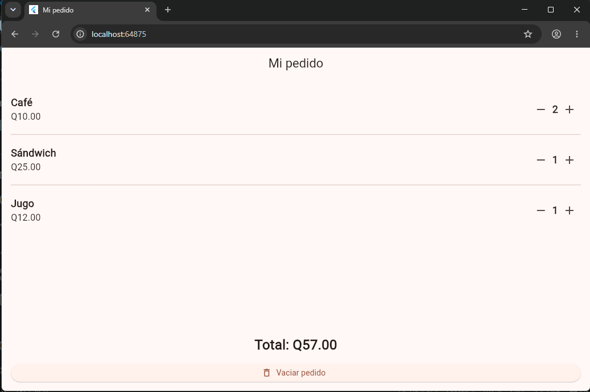

# Laboratorio - Mi pedido de cafetería

En este laboratorio realicé una aplicación en Flutter para llevar el control de un pedido de cafetería.

La aplicación tiene tres productos:

- Café - Q10.00
- Sándwich - Q25.00
- Jugo - Q12.00

Cada producto permite aumentar o disminuir su cantidad. También se muestra el total del pedido y existe un botón para vaciarlo completamente.

## Captura de funcionamiento

En esta prueba se agregaron 2 cafés, 1 sándwich y 1 jugo, dando un total de Q57.00.

## ¿Cómo se calcula el total?

El total se calcula multiplicando el precio de cada producto por la cantidad seleccionada y luego sumando los resultados.

Por ejemplo:

- 2 cafés: 2 x Q10.00 = Q20.00
- 1 sándwich: 1 x Q25.00 = Q25.00
- 1 jugo: 1 x Q12.00 = Q12.00

Total: Q57.00.

## ¿Por qué conviene reutilizar ProductoPedido?

Conviene utilizar el widget ProductoPedido porque los tres productos tienen una estructura parecida. De esta forma no es necesario repetir el mismo código para cada uno. Solo se envía el nombre, precio, cantidad y las acciones de los botones.

Esto hace que el código sea más ordenado y fácil de modificar.