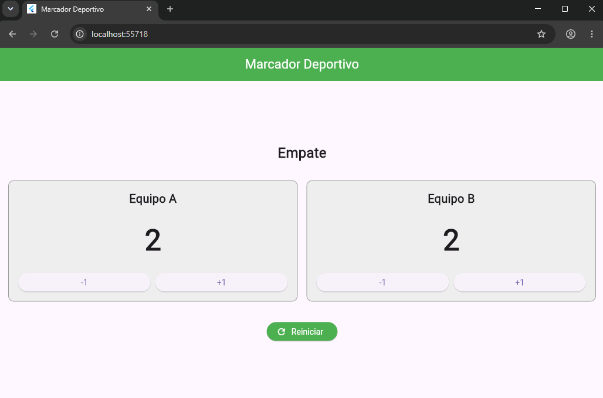
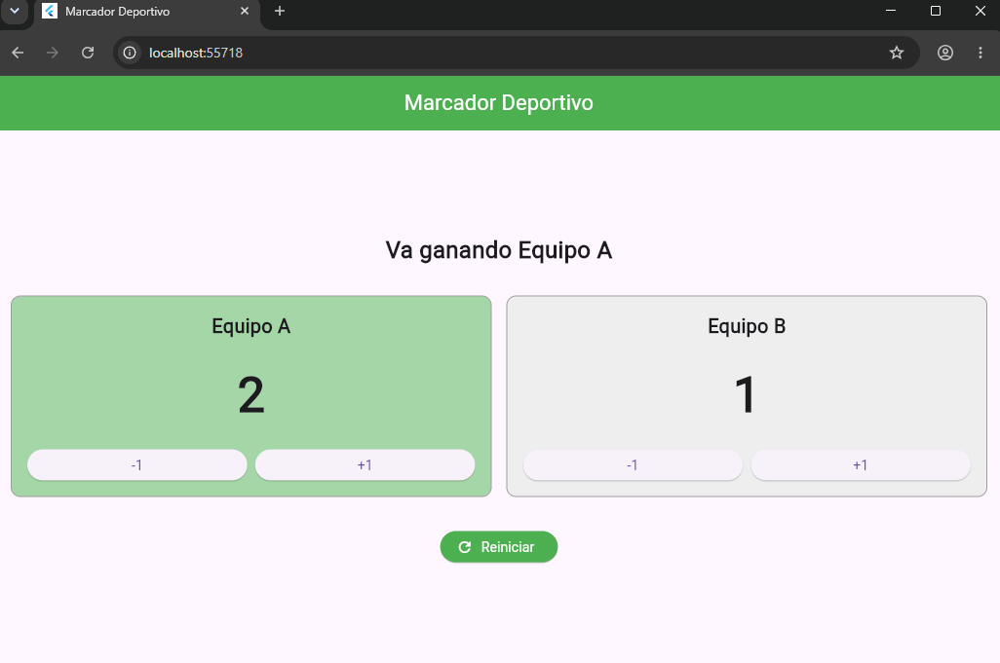

# Marcador Deportivo

Laboratorio realizado en Flutter y Dart.

La aplicación muestra un marcador para dos equipos. Cada equipo puede sumar y restar puntos utilizando los botones +1 y -1.

El marcador no permite valores negativos. También muestra qué equipo va ganando y cambia a color verde la tarjeta del equipo que tiene más puntos.

Cuando los dos equipos tienen la misma cantidad de puntos se muestra el mensaje "Empate".

El botón Reiniciar regresa ambos marcadores a cero.

## Capturas

### Empate

### Equipo ganando

## ¿Qué hace setState?

`setState` permite indicar a Flutter que un valor cambió y que la interfaz debe actualizarse.

Por ejemplo, cuando se presiona el botón +1, se cambia la cantidad de puntos dentro de `setState` y Flutter vuelve a mostrar el marcador con el nuevo valor.

Si se cambian los puntos sin llamar a `setState`, el valor puede cambiar internamente, pero la pantalla no se actualizaría inmediatamente para mostrar el nuevo resultado.